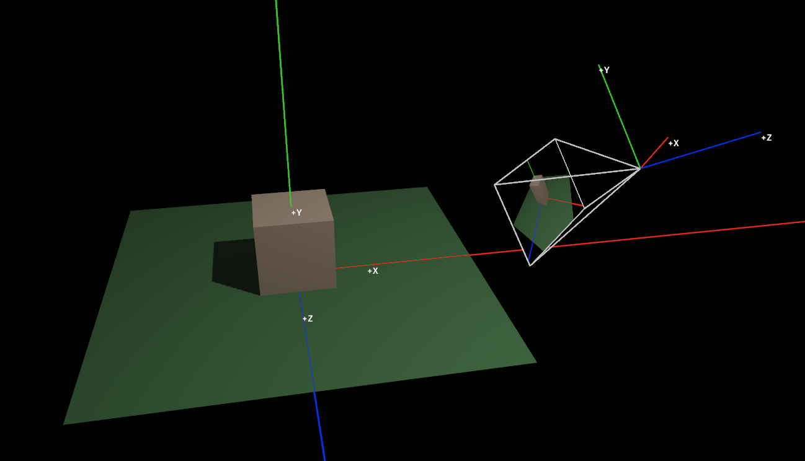

As of bevy 0.12 these are now included in bevy.

Import with `#import bevy_pbr::view_transformations`

https://github.com/bevyengine/bevy/blob/v0.12.0/crates/bevy_pbr/src/render/view_transformations.wgsl

# bevy_coordinate_systems
Definitions and helper functions for working with coordinate systems in bevy.
Implemented for use in both bevy systems and shaders.

## WIP

Tutorial example
